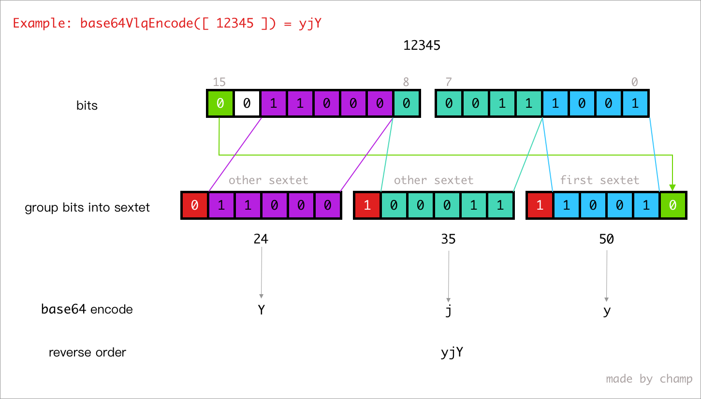

# base64-vlq

A base64 vlq encode/decode utils for source maps.

> NOTE:  
> VLQ encoding here is different from described in [wikipedia](https://en.wikipedia.org/wiki/Variable-length_quantity), vlq here is use sextet **not octet**.

> NOTE 2:  
> This package is only support nodejs environment currently.

## Install
```shell
npm i base64-vlq
```

## Usage
```js
const {base64VlqEncode, base64VlqDecode} = require('base64-vlq')

base64VlqEncode([ 0, 0, 16, 1 ]) // AAgBC
base64VlqDecode('AAgBC') // [ 0, 0, 16, 1 ]

base64VlqEncode([ 0 ]) // A
base64VlqDecode('A') // [ 0 ]

base64VlqEncode([ -0 ]) // B
base64VlqDecode('B') // [ -0 ]
```

## Encoding

